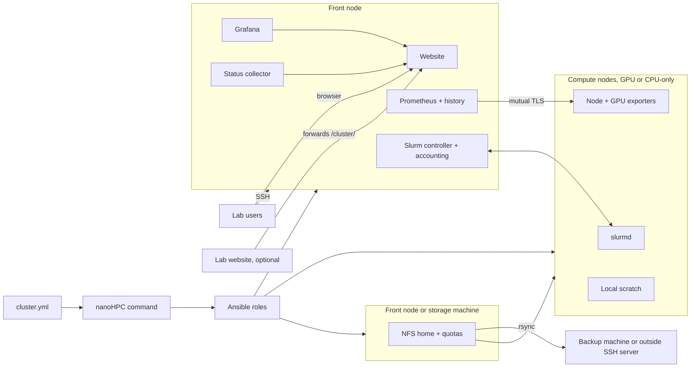

# nanoHPC

## Project gist

### Gist and goal

nanoHPC turns a set of Linux machines into a Slurm cluster with monitoring and a user website. The administrator writes one configuration file (`cluster.yml`) that lists the machines, users, partitions, and queue policy, then runs one command. nanoHPC installs and configures everything.

It is for small labs and research groups with up to about 100 machines, usually a mix of GPU workstations (different NVIDIA models) and CPU-only machines, and no dedicated HPC team. Today these groups either share machines informally (people log in and hope the GPU is free) or spend weeks building their own Slurm setup. Large HPC tools (OpenHPC, Bright, Qlustar) are built for bigger sites and are too heavy for this. Plain Slurm Ansible roles install the scheduler but give users no monitoring and no website.

nanoHPC is extracted from a working private lab cluster: one front node and GPU compute nodes, in daily use. The goal is to keep what worked there, remove everything specific to that site, and make it configurable. It is an open source tool (MIT license), not a commercial product.

What a user of the finished cluster gets:

- One front node to SSH into. Jobs go to compute nodes through Slurm.
- A shared `/home` on every machine, with per-user disk quotas, and a nightly backup copy.
- Fair GPU sharing: fair-share priority based on recent GPU usage, plus waiting time, and per-user limits.
- Partitions defined by the administrator (for example a `main` partition for batch jobs and an `interactive` partition for a shell on a compute node).
- Optional private scratch copies of a project for a job (`cluster-submit`), with declared outputs copied back.
- A read-only website with live machine status, queue, GPU usage history, current policies, and a how-to guide.

### Plan

The work moves from the source deployment to a released tool in phases. Task-level items are in [TODO.md](TODO.md). The agreed decisions for the port are in [plan-port.md](md/plan-port.md).

1. **Define**: agree on the supported setups and the open design decisions. Done 2026-09-30.
2. **Configuration**: the `cluster.yml` format, its validation, and example files. Done 2026-09-30.
3. **Simulated cluster**: a test cluster of Lima VMs on macOS and Linux, so nanoHPC is tested without touching a real cluster. Done 2026-09-30.
4. **Port and bootstrap**: bring Slurm, accounts, storage, monitoring, website, and backup over from the source deployment, made generic. One command sets up a new cluster from `cluster.yml`.
5. **Wizard and operate**: a wizard writes `cluster.yml` by asking questions and probing the machines. Add a node and redeploy from the same file.
6. **Release v0.1**: tested on the simulated cluster and on real x86 machines, documented, published.
7. **Later**: LDAP users, AMD GPUs, restic and S3 backups, non-Ubuntu systems, other extras.

## Technical specifications

Tech stack. Most of it comes from the source deployment; changes from it are noted.

- **Ubuntu 22.04, 24.04, and 26.04** on all machines (the source deployment is 22.04 only), each checked with a deploy on the simulated cluster.
- **Slurm** 26.05.4 (`slurmctld`, `slurmdbd`, `slurmd`) with **Munge** authentication and GPU scheduling. nanoHPC builds Slurm from the official source, once per Ubuntu release and CPU type, caches the packages on the administrator's machine, and installs them on all machines (the source deployment used packages built by hand). Partitions, their job types (batch, interactive shell, or any), limits, and fair-share on GPU usage come from `cluster.yml`.
- **NVIDIA GPUs** of any model, mixed across nodes, and CPU-only nodes. NVIDIA drivers must be installed beforehand; nanoHPC checks the GPU count.
- **Ansible** for all machine configuration, as roles and playbooks. The administrator does not edit Ansible files: nanoHPC generates them from `cluster.yml`.
- **`nanohpc` command** in **Python**, installed with `uv tool install`. It runs from any machine with SSH access to the cluster (the administrator's laptop or the front node).
- **Local users** with fixed UIDs and SSH keys, created from `cluster.yml` on every machine. SSH is key-only; all users may log in to the front node, only administrators to the other machines.
- **Root for deploys**: nanoHPC connects with `ssh <machine>` (the administrator's own SSH config) and adds no passwordless sudo rules. Administrators' forwarded SSH keys unlock sudo (`pam_ssh_agent_auth`); the first setup of a machine needs root the normal way.
- **systemd** services and timers for the collector, quotas, scratch cleanup, backup, and health checks.
- **NFS** for the shared `/home`, with **disk quotas**, served from the front node or from a separate storage machine, on the administrator's disk (never formatted by nanoHPC) or the root disk. Exported `no_root_squash`, with `/home` mounted `nosuid,nodev` on every machine.
- **Local scratch** on each compute node, with automatic cleanup of old files.
- **rsync** backup of `/home` to a backup machine in the cluster or to an outside SSH server.
- **uv** (pinned, checksum checked) installed for users' Python environments; `cluster-submit` runs jobs in a private scratch copy of a project; `cluster-health` checks each machine and runs at the end of every deploy.
- **Prometheus** with **node_exporter** and GPU metrics. The front node scrapes the other machines over mutually authenticated TLS. A second Prometheus keeps daily summaries for 5 years.
- **Grafana** with read-only dashboards embedded in the website: queue, queue history, GPU usage, machines, long-term history.
- **Python collector** (`cluster-monitor-snapshot`) that writes a `status.json` snapshot every 30 seconds for the website.
- **React + TypeScript + Vite** website, shipped prebuilt in the package (or built on the front node), served by its own **nginx** on the front node over HTTPS (Let's Encrypt or the administrator's own certificate), under a configurable path.
- **Slack alerts** from health checks (optional), and **automatic redeploy** when the administrator's configuration repository changes (optional).
- Fixed install paths on every cluster (`/etc/nanohpc`, `/var/lib/nanohpc`). The cluster name only appears in the website, dashboards, and Slurm.
- **Python `unittest`** and **Playwright** browser tests. **Lima** VMs for the simulated test cluster ([testing setup](md/testing.md)).

Main components:

- **Configuration file** (`cluster.yml`): the only file the administrator edits. It lists the front node, the compute nodes (address, CPUs, memory, GPU type and count, partitions, scratch), the optional storage and backup machines, the users, the partitions, and the queue policy. Example files and a wizard (`nanohpc init`) give simple defaults.
- **nanoHPC command**: writes (wizard), validates, and turns the configuration into Ansible inventory, and runs the right playbooks (bootstrap, add node, redeploy).
- **Front node**: Slurm controller and accounting database, login node, Prometheus, Grafana, the collector, and the website. By default also the `/home` server.
- **Storage machine** (optional): serves `/home` over NFS instead of the front node.
- **Backup machine** (optional): receives the nightly `/home` backup. The backup can also go to an outside SSH server.
- **Compute nodes**: `slurmd`, node and GPU exporters, local scratch. GPU or CPU-only.
- **Website**: reads live data only from `status.json` and the embedded Grafana dashboards, so new machines appear without code changes. Public views are read-only. Administration is over SSH only.

## Status

- The design decisions were agreed on 2026-09-30 ([plan-port.md](md/plan-port.md)).
- Built: the `cluster.yml` format ([examples/cluster.yml](examples/cluster.yml), [examples/minimal.yml](examples/minimal.yml)) and `nanohpc validate`, which checks a configuration and reports every error with its field path (`src/nanohpc/config.py`). Tests: `uv run python -m unittest discover -s tests`.
- Built: the simulated test cluster, `nanohpc sim up/down` with Lima VMs ([testing.md](md/testing.md)). Checked on macOS (Apple Silicon) with the everyday, home-on-storage, and 20-node clusters, and on a Linux x86 host with the everyday cluster (GitHub Actions, run by hand only).
- Built: `nanohpc deploy`: Slurm, users, SSH access, sudo by forwarded key, and Munge (M3a), checked end to end on the simulated cluster (Ubuntu 24.04, ARM64). See [DONE.md](md/DONE.md).
- Built: `/home` over NFS with quotas and local scratch with cleanup (M3b), checked on the simulated cluster with Ubuntu 22.04, 24.04, and 26.04, and both `/home` layouts.
- Built: `cluster-submit` job modes, `stage-dataset`, uv for users, and `cluster-health`, which every deploy runs at the end (M3c). With this, setting up Slurm, users, storage, and scratch (phase 4's cluster part) is done; open follow-ups are in [TODO.md](TODO.md).
- Built: metrics (M4a): certificates issued and renewed by a private authority on the front node, node exporters over mutual TLS on every machine, machine-spec and GPU collectors, Prometheus with 90-day detail and 5-year daily history.
- Built: the status collector and Grafana (M4b): a 30-second `status.json` snapshot for the website, machine health from each machine's required services and mounts, users' quotas from the home machine, and six read-only Grafana dashboards on the front node's localhost. With this, monitoring (M4) is done.
- Built: the website (M5): content from `cluster.yml` and the status snapshot, served by nginx on the front node under a configurable path (default `/cluster/`) over HTTPS (Let's Encrypt or the administrator's own certificate), optionally limited to listed networks, with forwarding rules for a lab's own website. Checked with a real browser on the simulated cluster. See [testing.md](md/testing.md).
- Built: nightly `/home` backup to the backup machine or an outside SSH server, and Slack alerts from the front node when a check starts failing or recovers (M6a).
- Next: automatic deploys (M6b): the front node deploys the whole cluster from the configuration repository by itself. Agreed for later: a dry run before every deploy (M8) and key-only root login for administrators ([plan-port.md](md/plan-port.md)).
- The source deployment works in production on one front node and GPU compute nodes: Slurm with fair-share, shared home with quotas, scratch mode, monitoring, and the website.
- Known gaps to close before it can be reused (from a review of the source deployment):
  - Site-specific parts are mixed into the main setup and must be removed.
  - The cluster name is hardcoded in paths, dashboard IDs, and website code.
  - The user guide on the website is written for one site and must come from configuration.
  - Slurm installation needs packages built by hand.
  - Accounts are only checked, not created: users must already exist with matching UIDs.
  - Only GPU compute nodes and the fixed partitions `main` and `interactive` are allowed.
  - There is no single command to set up a new cluster or add a node. The setup is a series of manual playbooks, and certificates and the Munge key are copied by hand.
  - It has no simulated cluster: tests run only locally with mocks, or live on the production machines.

## Notes

- **Source deployment**: the running implementation is the SLURM-REAL repository (`git@github.com:enajx/SLURM-REAL.git`, local checkout at `/Users/enaj/code/SLURM-REAL`). It runs a production cluster.
  - **Treat it as read-only reference.** Never edit, commit to, or deploy from it while working on nanoHPC.
  - Code and docs are copied from it and then made generic. Its site-specific names, hosts, and services must not come into nanoHPC.
  - nanoHPC will diverge from it over time. After extraction, nanoHPC is its own project and does not have to stay in sync.
  - Useful references there: `md/cluster-monitor-design.md` (monitoring and machine status rules), `md/cluster-usage.md` (job modes and queue policy), `md/cluster-filesystem.md` (home and scratch layout), `md/cluster-network-plan.md` (machine definition and enrollment steps), `md/how-I-fucked-up-setup.md` (safety checks before changing accounts, homes, or SSH access), `filter_plugins/cluster_machine_config.py` (configuration checker), `tests/` (unit, integration, and browser tests), `reports/` (policy test results).
  - Moving the production cluster from SLURM-REAL to nanoHPC: maybe later, not planned.
- **Out of scope, in any form**: anything related to the forum software that shared the source deployment's front node. That was an accident of that site. The website runs on its own web server. Slurm-web (a job browser in the source deployment) is not carried over.
- **Decisions**: the design decisions for the port are recorded in [plan-port.md](md/plan-port.md). Their outcome is reflected in the sections above.
