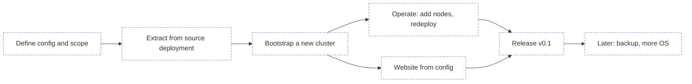
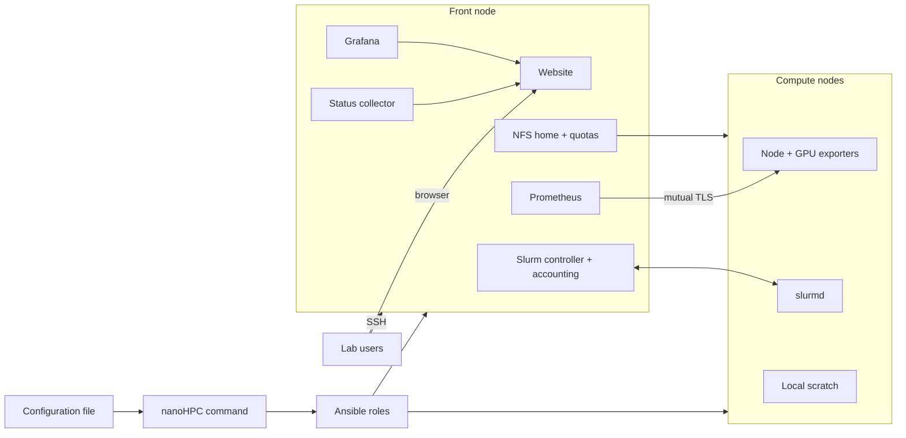

# nanoHPC

## Project gist

### Gist and goal

nanoHPC turns a few Linux machines into a small Slurm cluster with monitoring and a user website. The administrator writes one configuration file that lists the machines, users, and queue policy, then runs one command. nanoHPC installs and configures everything.

It is for small labs and research groups with roughly 2 to 10 machines, usually GPU workstations, and no dedicated HPC team. Today these groups either share machines informally (people log in and hope the GPU is free) or spend weeks building their own Slurm setup. Large HPC tools (OpenHPC, Bright, Qlustar) are built for bigger sites and are too heavy for this. Plain Slurm Ansible roles install the scheduler but give users no monitoring and no website.

nanoHPC is extracted from a working private lab cluster: one front node and GPU compute nodes, in daily use. The goal is to keep what worked there, remove everything specific to that site, and make it configurable. It is an open source tool, not a commercial product.

What a user of the finished cluster gets:

- One front node to SSH into. Jobs go to compute nodes through Slurm.
- A shared `/home` on every machine, with per-user disk quotas.
- Fair GPU sharing: fair-share priority based on recent GPU usage, plus waiting time, and per-user limits.
- A `main` partition for batch jobs and an `interactive` partition for a shell on a compute node.
- Optional private scratch copies of a project for a job (`cluster-submit`), with declared outputs copied back.
- A read-only website with live machine status, queue, GPU usage history, current policies, and a how-to guide.

### Plan

The work moves from the source deployment to a released tool in phases. Task-level items are in [TODO.md](TODO.md).

1. **Define**: agree on the configuration file format, the supported setups, and the open design decisions (see Notes).
2. **Extract**: bring the Ansible roles, collector, dashboards, and website over from the source deployment, with site-specific parts removed and names made generic.
3. **Bootstrap**: one command sets up a new cluster from the configuration file on fresh machines.
4. **Operate**: add a compute node, change users or policy, and redeploy from the same configuration file.
5. **Website from config**: cluster name, branding, and the user guide come from the configuration, not from source code.
6. **Release v0.1**: tested on fresh machines, documented, published.
7. **Later**: a general backup module, more operating system versions, other extras.

## Technical specifications

Tech stack, all carried over from the source deployment:

- **Ubuntu 22.04** on the front node and compute nodes (other versions are an open question).
- **Slurm** (`slurmctld`, `slurmdbd`, `slurmd`) with **Munge** authentication and GPU scheduling.
- **Ansible** for all machine configuration, as roles and playbooks.
- **systemd** services and timers for the collector, quotas, scratch cleanup, and health checks.
- **NFS** for the shared `/home` served from the front node, with **disk quotas**.
- **Local scratch** on each compute node, with automatic cleanup of old files.
- **uv** installed for users' Python environments.
- **Prometheus** with **node_exporter** and GPU metrics. The front node scrapes the compute nodes over mutually authenticated TLS.
- **Grafana** with read-only dashboards embedded in the website: queue, queue history, GPU usage, machines, long-term history.
- **Python collector** (`cluster-monitor-snapshot`) that writes a `status.json` snapshot every 30 seconds for the website.
- **React + TypeScript + Vite** website, served by **nginx** on the front node.
- **Python `unittest`** and **Playwright** browser tests.

Main components:

- **Configuration file**: the only file the administrator edits. It lists the front node, the compute nodes (address, CPUs, memory, GPU type and count, partitions, scratch), the users, and the queue policy.
- **nanoHPC command**: validates the configuration, turns it into Ansible inventory, and runs the right playbooks (bootstrap, add node, redeploy).
- **Front node**: Slurm controller and accounting database, NFS home server, login node, Prometheus, Grafana, the collector, and the website.
- **Compute nodes**: `slurmd`, node and GPU exporters, local scratch.
- **Website**: reads live data only from `status.json` and the embedded Grafana dashboards, so new machines appear without code changes. Public views are read-only. Administration is over SSH only.

## Status

- Nothing is built in this repository yet. This file and [TODO.md](TODO.md) define the project.
- The source deployment works in production on one front node and GPU compute nodes: Slurm with fair-share, shared home with quotas, scratch mode, monitoring, and the website.
- Known gaps to close before it can be reused (from a review of the source deployment):
  - Site-specific parts are mixed into the main setup and must be removed.
  - The cluster name is hardcoded in paths, dashboard IDs, and website code.
  - The user guide on the website is written for one site and must come from configuration.
  - Slurm installation needs package names and a release filled in by hand.
  - Accounts are only checked, not created: users must already exist with matching UIDs.
  - There is no single command to set up a new cluster or add a node. The setup is a series of manual playbooks.

## Notes

- **Out of scope, in any form**: anything related to the forum software that shared the source deployment's front node. That was an accident of that site. The website runs on its own web server.
- **Backup**: the source deployment has a backup of home directories to an institution's storage. nanoHPC may get a general, optional `backup` module that works with different storage services, including the kind universities provide. This comes much later.
- **Open design decisions** (to agree with the user before building):
  - Where Slurm packages come from: build them, ship prebuilt packages, or use the distribution's packages.
  - Which Ubuntu versions to support.
  - User management: nanoHPC creates local users with fixed UIDs, or connects to an existing directory (LDAP).
  - GPU drivers: installed by nanoHPC or required beforehand.
  - Configuration file format and name.
  - Setup shapes: is the front node always also the login node and home server.
  - HTTPS for the website: Let's Encrypt, the administrator's own certificate, or plain HTTP on a private network.
  - Which extras from the source deployment to keep: automatic redeploy from Git, Slurm-web job browser, Slack alerts.
  - Language and packaging of the `nanoHPC` command.
  - License.
