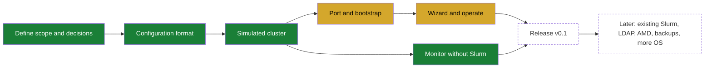
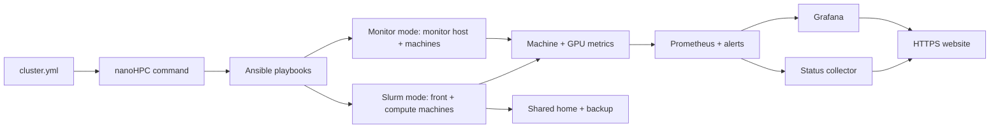

# nanoHPC

## Project gist

### Gist and goal

nanoHPC sets up a Slurm cluster with monitoring and a user website, or deploys only monitoring on machines where people run work directly. The administrator writes one `cluster.yml` and runs the command for that mode. Slurm mode includes machines, users, partitions, and queue policy; monitor mode uses machine addresses and existing login names.

It is for small labs and research groups with up to about 100 machines, usually a mix of GPU workstations (different NVIDIA models) and CPU-only machines, and no dedicated HPC team. Today these groups either share machines informally (people log in and hope the GPU is free) or spend weeks building their own Slurm setup. Large HPC tools (OpenHPC, Bright, Qlustar) are built for bigger sites and are too heavy for this. Plain Slurm Ansible roles install the scheduler but give users no monitoring and no website.

nanoHPC is extracted from a working private lab cluster: one front node and GPU compute nodes, in daily use. The goal is to keep what worked there, remove everything specific to that site, and make it configurable. It is an open source tool (MIT license), not a commercial product.

What a user of a Slurm cluster gets:

- One front node to SSH into. Jobs go to compute nodes through Slurm.
- A shared `/home` on every machine, with per-user disk quotas, and a nightly backup copy.
- Fair GPU sharing: fair-share priority based on recent GPU usage, plus waiting time, and per-user limits.
- Partitions defined by the administrator (for example a `main` partition for batch jobs and an `interactive` partition for a shell on a compute node).
- Optional private scratch copies of a project for a job (`cluster-submit`), with declared outputs copied back.
- A read-only website with live machine status, queue, GPU usage history, current policies, and a how-to guide.

In monitor mode, a designated monitor host runs the shared monitoring services and website. The website shows machine health, measured GPU use, usage history, and existing login names. nanoHPC does not change Slurm, accounts, SSH access, or storage in this mode.

### Plan

The work moves from the source deployment to a released tool in phases. Task-level items are in [TODO.md](TODO.md). The agreed decisions for the port are in [plan-port.md](md/plan-port.md).

1. **Define**: agree on the supported setups and the open design decisions. Done 2026-09-30.
2. **Configuration**: the `cluster.yml` format, its validation, and example files. Done 2026-09-30.
3. **Simulated cluster**: a test cluster of Lima VMs on macOS and Linux, so nanoHPC is tested without touching a real cluster. Done 2026-09-30.
4. **Port and bootstrap**: bring Slurm, accounts, storage, monitoring, website, and backup over from the source deployment, made generic. One command sets up a new cluster from `cluster.yml`.
5. **Wizard and operate**: a wizard writes `cluster.yml` by asking questions and probing the machines. Add a node and redeploy from the same file.
6. **Release v0.1**: tested on the simulated cluster and on real x86 machines, documented, published.
7. **Later**: monitoring on a cluster with existing Slurm, LDAP users, AMD GPUs, restic and S3 backups, non-Ubuntu systems, other extras.

## Technical specifications

Tech stack. Most of it comes from the source deployment; changes from it are noted.

- **Ubuntu 22.04, 24.04, and 26.04** on all machines (the source deployment is 22.04 only), each checked with a deploy on the simulated cluster.
- **Slurm** 26.05.4 (`slurmctld`, `slurmdbd`, `slurmd`) with **Munge** authentication and GPU scheduling. nanoHPC builds Slurm from the official source, once per Ubuntu release and CPU type, caches the packages on the administrator's machine, and installs them on all machines (the source deployment used packages built by hand). Partitions, their job types (batch, interactive shell, or any), limits, and fair-share on GPU usage come from `cluster.yml`.
- **NVIDIA GPUs** of any model, mixed across nodes, and CPU-only nodes. NVIDIA drivers must be installed beforehand; nanoHPC checks the GPU count.
- **Ansible** for all machine configuration, as roles and playbooks. The administrator does not edit Ansible files: nanoHPC generates them from `cluster.yml`.
- **`nanohpc` command** in **Python**, installed with `uv tool install`. It runs from any machine with SSH access to the cluster (the administrator's laptop or the front node).
- **Local users in Slurm mode** with fixed UIDs and SSH keys, created from `cluster.yml` on every machine. SSH is key-only; all users may log in to the front node, only administrators to the other machines. Monitor mode lists existing login names without changing accounts or SSH.
- **Root for deploys**: nanoHPC connects with `ssh <machine>` (the administrator's own SSH config) and adds no passwordless sudo rules. Administrators' forwarded SSH keys unlock sudo (`pam_ssh_agent_auth`); the first setup of a machine needs root the normal way. Administrators in `cluster.yml` also have key-only root login on every machine for recovery, with their keys on local disk in `/etc/ssh/authorized_keys/root`.
- **systemd** services and timers for the collector, quotas, scratch cleanup, backup, and health checks.
- **NFS** for the shared `/home`, with **disk quotas**, served from the front node or from a separate storage machine, on the administrator's disk (never formatted by nanoHPC) or the root disk. Exported `no_root_squash`, with `/home` mounted `nosuid,nodev` on every machine. The home server installs the extra-module package for its current kernel and the package that keeps quota modules with future kernel updates.
- **Local scratch** on each compute node. Daily cleanup removes staged data unused for `scratch.cleanup_days` days and kept job copies `scratch.job_retention_days` days after their Slurm job ended (defaults: 14 and 7 days).
- **rsync** backup of `/home` to a backup machine in the cluster or to an outside SSH server.
- **uv** (pinned, checksum checked) installed for users' Python environments; `cluster-submit` runs jobs in a private scratch copy of a project; `cluster-health` checks each machine and runs at the end of every deploy.
- **Prometheus** with **node_exporter** and GPU metrics. The front node or designated monitor host scrapes the other machines over mutually authenticated TLS. A second Prometheus keeps daily summaries for 5 years.
- **Grafana** with read-only dashboards embedded in the website: queue, queue history, GPU usage, machines, and long-term history in Slurm mode; machines and measured usage history in monitor mode.
- **Python collector** (`cluster-monitor-snapshot`) that writes a `status.json` snapshot every 30 seconds for the website.
- **React + TypeScript + Vite** website, shipped prebuilt in the package (or built on the machine serving it), served by its own **nginx** on the front node or monitor host over HTTPS (Let's Encrypt or the administrator's own certificate), under a configurable path. Monitor mode shows Overview, Machines, Usage, and Users without job or queue claims.
- **Slack alerts** from health checks (optional), and **automatic redeploy** when the administrator's configuration repository changes (optional).
- Fixed install paths on every cluster (`/etc/nanohpc`, `/var/lib/nanohpc`). The cluster name only appears in the website, dashboards, and Slurm.
- **Python `unittest`** and **Playwright** browser tests. **Lima** VMs for the simulated test cluster ([testing setup](md/testing.md)).

Main components:

- **Configuration file** (`cluster.yml`): the only file the administrator edits. Slurm mode lists the front node, compute nodes, optional storage and backup machines, users, partitions, and queue policy. Monitor mode lists a monitor host, machine addresses, and existing login names. Examples and `nanohpc init` support both modes.
- **nanoHPC command**: writes (wizard), validates, and turns the configuration into Ansible inventory. `nanohpc deploy` sets up Slurm mode; `nanohpc deploy-monitor` sets up monitoring only. Both support dry runs and node deploys.
- **Front node**: Slurm controller and accounting database, login node, Prometheus, Grafana, the collector, and the website. By default also the `/home` server.
- **Storage machine** (optional): serves `/home` over NFS instead of the front node.
- **Backup machine** (optional): receives the nightly `/home` backup. The backup can also go to an outside SSH server.
- **Compute nodes**: `slurmd`, node and GPU exporters, local scratch. GPU or CPU-only.
- **Monitor host and machines**: the host runs Prometheus, Grafana, alerts, the collector, and the website. Each directly used machine runs node and optional GPU exporters. The monitor host can also run work.
- **Website**: reads live data only from `status.json` and the embedded Grafana dashboards, so new machines appear without code changes. Public views are read-only. Administration is over SSH only.

## Status

- The design decisions were agreed on 2026-09-30 ([plan-port.md](md/plan-port.md)).
- Built: the `cluster.yml` format ([examples/cluster.yml](examples/cluster.yml), [examples/minimal.yml](examples/minimal.yml)) and `nanohpc validate`, which checks a configuration and reports every error with its field path (`src/nanohpc/config.py`). Tests: `uv run python -m unittest discover -s tests`.
- Built: the simulated test cluster, `nanohpc sim up/down` with Lima VMs ([testing.md](md/testing.md)). Checked on macOS (Apple Silicon) with the everyday, home-on-storage, and 20-node clusters, and on a Linux x86 host with the everyday cluster (GitHub Actions, run by hand only).
- Built: `nanohpc deploy`: Slurm, users, SSH access, sudo by forwarded key, and Munge (M3a), checked end to end on the simulated cluster (Ubuntu 24.04, ARM64). See [DONE.md](md/DONE.md).
- Built: `/home` over NFS with quotas and local scratch with cleanup (M3b), checked on the simulated cluster with Ubuntu 22.04, 24.04, and 26.04, and both `/home` layouts.
- Built: `cluster-submit` job modes, `stage-dataset`, uv for users, and `cluster-health`, which every deploy runs at the end (M3c). With this, setting up Slurm, users, storage, and scratch (phase 4's cluster part) is done; open follow-ups are in [TODO.md](TODO.md).
- Built: metrics (M4a): certificates issued and renewed by a private authority on the front node, node exporters over mutual TLS on every machine, machine-spec and GPU collectors, Prometheus with 90-day detail and 5-year daily history.
- Built: the status collector and Grafana (M4b): a 30-second `status.json` snapshot for the website, machine health from each machine's required services and mounts, users' quotas from the home machine, and six read-only Grafana dashboards on the front node's localhost. With this, monitoring (M4) is done.
- Built: the website (M5): content from `cluster.yml` and the status snapshot, served by nginx on the front node under a configurable path (default `/cluster/`) over HTTPS (Let's Encrypt or the administrator's own certificate), optionally limited to listed networks, with forwarding rules for a lab's own website. Checked with a real browser on the simulated cluster. See [testing.md](md/testing.md).
- Built: monitor-only deployment without Slurm: a monitor-mode `cluster.yml`, example, wizard, `deploy-monitor`, mode-aware `check`, alerts, snapshots, Grafana, and website. It leaves accounts, SSH, storage, and Slurm alone. Checked on three Ubuntu 24.04 VMs, including a node-only deploy. See [DONE.md](md/DONE.md) and [testing.md](md/testing.md).
- Published: the [public demo](https://najarro.science/nanoHPC/) uses fictional cluster data and four fixed Grafana snapshots. GitHub Pages rebuilds it from `main`; the live pages and snapshots were checked in Chromium. See [DONE.md](md/DONE.md).
- Built: nightly `/home` backup to the backup machine or an outside SSH server, and Slack alerts from the front node when a check starts failing or recovers (M6a).
- Built: automatic deploys (M6b): the front node deploys the whole cluster from a branch of the configuration repository by itself (every few minutes or on a GitHub webhook), with the pinned nanoHPC version, its root login key limited to the front node, and failed commits reported and not retried.
- Built: the setup wizard (M7): `nanohpc init`, a full-screen terminal app that probes the machines and writes or edits `cluster.yml`; `nanohpc fix-uid`; [SETUP-for-AGENTS.md](SETUP-for-AGENTS.md) for agents.
- Built: a dry run before every deploy (M8a): every deploy, manual or automatic, previews the changes on every machine first; machines whose dry run fails are left out (nothing is deployed when the front node or the home machine fails).
- Built: partial deploys (M8b): `nanohpc deploy --only users|policy|partitions|node NAME` runs one part, with the same checks and dry run first.
- Built: `nanohpc check` (M8b): a read-only report on every machine against `cluster.yml` (SSH, health, users, mounts, GPUs, Slurm, deployed version), problems first.
- Built: `nanohpc check --before-restart`: a read-only pass/fail report for every machine, including the front node, on fstab boot mounts, GRUB's next kernel and NVIDIA module, saved versus running Netplan or persistent NetworkManager settings, and automatic update restarts. Unverifiable results fail. See [DONE.md](md/DONE.md).
- Built: `nanohpc restart CLUSTER_YML MACHINE --confirm MACHINE` for one compute machine: it drains the node, waits for allocated jobs, checks saved boot settings, reboots, checks fresh root and invoking administrator logins, the kernel, GPUs, `/home`, `/scratch`, and `slurmd`, then releases the node after a reserved Slurm test job passes. Failures leave it drained; front-node restarts stay manual. Ubuntu 24.04 VM tests covered an unsafe fstab refusal and a real job followed by reboot and a Slurm test job. See [DONE.md](md/DONE.md) and [testing.md](md/testing.md).
- Built: `nanohpc update-report CLUSTER_YML` reads saved APT lists on every configured machine without changing them, shows their age and waiting updates in built-in care, extra-source, security, and rest groups, and fails clearly if a machine cannot be checked. Checked through real SSH and `python3-apt` on Ubuntu 24.04 VMs. The confirmed compute update remains queued. See [DONE.md](md/DONE.md).
- Built: key-only root login for administrators (M8b): their keys from `cluster.yml` work directly on every machine, even when `/home` is unavailable; the dry run stops before replacing root keys that would lose access. Checked on Ubuntu 24.04 VMs with the redeploy and automatic deploy tests. See [DONE.md](md/DONE.md).
- Built: daily cleanup of kept `cluster-submit` job copies, with a separate seven-day default. The full deploy and `--only users` paths passed on Ubuntu 24.04 VMs. See [DONE.md](md/DONE.md).
- Built: changed `/etc/fstab` entries remount existing `/home` and `/scratch` during deploy; the live `nosuid,nodev` options are checked. Ubuntu 24.04 VM tests cover home disk, NFS, root-disk bind, scratch disk, and scratch image. See [DONE.md](md/DONE.md).
- Checked: a deployed machine comes back after a reboot with `/home`, NFS, quotas, and `/scratch`. Ubuntu 24.04 VM tests cover a separate home server, NFS clients, both scratch layouts, and `/home` on the front node's root disk. See [testing.md](md/testing.md).
- Checked: XFS home and scratch disks work on Ubuntu 24.04 VMs. nanoHPC sets the configured XFS home quotas, and a user over the hard limit cannot write to `/home` through NFS. See [testing.md](md/testing.md).
- Checked: after an Ubuntu 24.04 kernel update and reboot, the home server still mounts `/home` with active quotas; a deploy works both before and after the update. See [testing.md](md/testing.md).
- Next: v0.1 after the VM tests on Ubuntu 22.04, 24.04, and 26.04 ([plan-port.md](md/plan-port.md), [TODO.md](TODO.md)).
- The source deployment works in production on one front node and GPU compute nodes: Slurm with fair-share, shared home with quotas, scratch mode, monitoring, and the website.
- Known gaps to close before it can be reused (from a review of the source deployment):
  - Site-specific parts are mixed into the main setup and must be removed.
  - The cluster name is hardcoded in paths, dashboard IDs, and website code.
  - The user guide on the website is written for one site and must come from configuration.
  - Slurm installation needs packages built by hand.
  - Accounts are only checked, not created: users must already exist with matching UIDs.
  - Only GPU compute nodes and the fixed partitions `main` and `interactive` are allowed.
  - There is no single command to set up a new cluster or add a node. The setup is a series of manual playbooks, and certificates and the Munge key are copied by hand.
  - It has no simulated cluster: tests run only locally with mocks, or live on the production machines.

## Notes

- **Source deployment**: the running implementation is the SLURM-REAL repository (`git@github.com:enajx/SLURM-REAL.git`, local checkout at `/Users/enaj/code/SLURM-REAL`). It runs a production cluster.
  - **Treat it as read-only reference.** Never edit, commit to, or deploy from it while working on nanoHPC.
  - Code and docs are copied from it and then made generic. Its site-specific names, hosts, and services must not come into nanoHPC.
  - nanoHPC will diverge from it over time. After extraction, nanoHPC is its own project and does not have to stay in sync.
  - Useful references there: `md/cluster-monitor-design.md` (monitoring and machine status rules), `md/cluster-usage.md` (job modes and queue policy), `md/cluster-filesystem.md` (home and scratch layout), `md/cluster-network-plan.md` (machine definition and enrollment steps), `md/how-I-fucked-up-setup.md` (safety checks before changing accounts, homes, or SSH access), `filter_plugins/cluster_machine_config.py` (configuration checker), `tests/` (unit, integration, and browser tests), `reports/` (policy test results).
  - Moving the production cluster from SLURM-REAL to nanoHPC: maybe later, not planned.
- **Out of scope, in any form**: anything related to the forum software that shared the source deployment's front node. That was an accident of that site. The website runs on its own web server. Slurm-web (a job browser in the source deployment) is not carried over.
- **Decisions**: the design decisions for the port are recorded in [plan-port.md](md/plan-port.md). Their outcome is reflected in the sections above.
