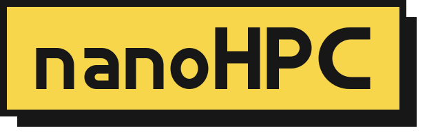
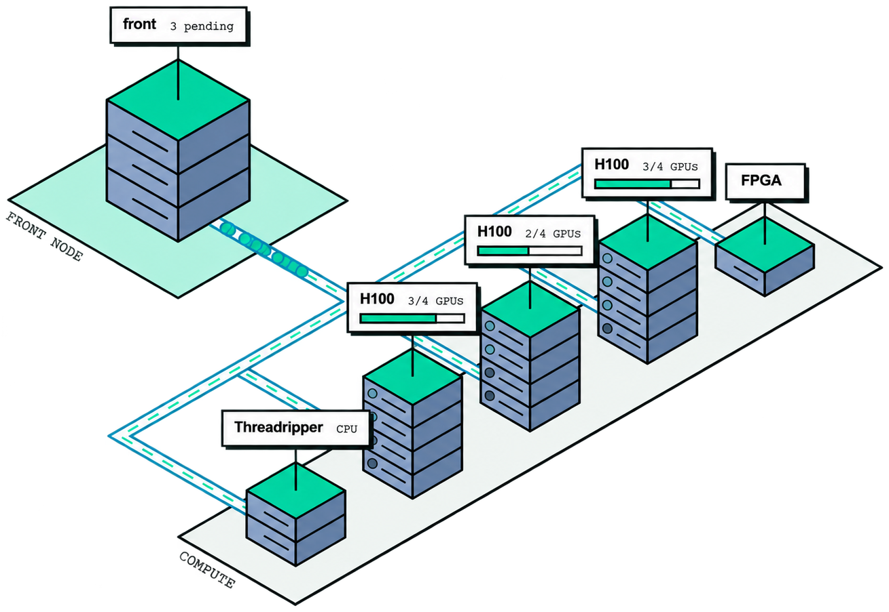

<p align="center">
  
</p>

`nanoHPC` is a lightweight Slurm cluster and monitoring tool for small computational labs.

The whole cluster is defined in a single file, `cluster.yml` (the machines, the users, the partitions, and the queue
policy), and one command sets up every machine.

- A single `cluster.yml` to define machines, users, partitions, and queue policy.
- Slurm scheduling for GPU and CPU jobs, with fair-share and per-user limits.
- A ready-made front-end monitoring cluster usage, queue and machines health.
- Playbooks for setup, node changes, policy updates, and nightly backups.
- Automatic health checks and Slack alerts for jobs and issues.
- Isometric visualisation of the cluster topology in real time:

<p align="center">
  
</p>

## Set up

You need:

- A set of Linux machines running Ubuntu 22.04, 24.04, or 26.04 (the releases nanoHPC is tested on), with NVIDIA
  drivers already installed on GPU machines.
- SSH access to every machine as an administrator with sudo.
- [uv](https://docs.astral.sh/uv/) on your own computer (macOS or Linux).

Install nanoHPC on your computer:

```sh
uv tool install git+https://github.com/enajx/nanoHPC
```

Write `cluster.yml` with the wizard, or start from [examples/cluster.yml](examples/cluster.yml):

```sh
nanohpc init
nanohpc validate cluster.yml
```

See what the deploy would change, then deploy:

```sh
nanohpc deploy cluster.yml --dry-run
nanohpc deploy cluster.yml
```

After changing `cluster.yml` later, deploy again, or only the part you changed:

```sh
nanohpc deploy cluster.yml --only users      # also: policy, partitions, node NAME
nanohpc check cluster.yml                    # report every machine against cluster.yml
```

If you prefer having your AI agents setting up the cluster, you can point them to
[SETUP-for-AGENTS.md](SETUP-for-AGENTS.md).

### Deploy Monitor only (without Slurm)

TBA

## Tech stack

       

- `Ansible` runs the setup on every machine; `nanohpc` writes its inventory and variables from `cluster.yml`.
- `Slurm` with `Munge` manages the queue and schedules jobs, and their GPUs, on the compute machines.
- `NFS` shares `/home` with disk quotas, and `rsync` backs it up every night.
- `Prometheus` tracks metrics and `Grafana` renders them in the monitoring dashboards; `Alertmanager` sends the
  Slack alerts.
- `React`, `TypeScript`, and `Vite` for the website, served by `nginx` with `Let's Encrypt`.
- `Textual` for the setup wizard.
- `Lima` VMs for the simulated test cluster; Python `unittest` and `Playwright` for the tests.

## License

[MIT](LICENSE)
