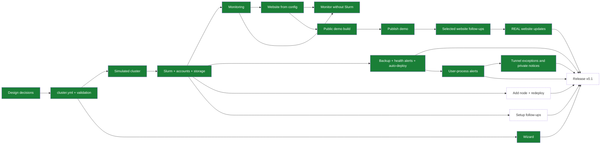

> Items are functional bullets: what we want (behaviour/function/outcome), not how to build it. The "how" stays in-session, not here. Notation: `[ ]` planned → `[~]` WIP → `[x]` done and verified. Keep it live: flip markers as work progresses, not just at commit time. When done, move a one-liner `[x]` here and a concise record of what was built to `md/DONE.md`.
> The `Implementation` section opens with the implementation-roadmap `mermaid` diagram (see [`DIAGRAMS.md`](md/instructions/DIAGRAMS.md)), status-matched to the bullets below it.
> (See AGENTS.md for the full workflow.)

# TODO

## Implementation

Agreed decisions for the port: [plan-port.md](md/plan-port.md).

### Design

- [x] The open design decisions are agreed with the user and recorded ([plan-port.md](md/plan-port.md)).
- [x] Where the cluster roles run is agreed: the front node always does login, the Slurm controller, monitoring, and the website; `/home` and the backup can each be on the front node or on separate machines.
- [x] How to test nanoHPC without real machines is decided ([testing.md](md/testing.md)).

### Configuration

- [x] Written example `cluster.yml` files (the 6-node test cluster, and a minimal front node + one GPU node) are agreed with the user as the target format.
- [x] The administrator describes the whole cluster in one `cluster.yml`: front node, compute nodes (GPU or CPU-only, mixed NVIDIA models), optional storage and backup machines, users, partitions, and queue policy.
- [x] Partitions and their limits are defined by the administrator, not fixed to `main` and `interactive`.
- [x] Each partition can accept only batch jobs, only the interactive shell, or any job (`jobs: batch | interactive | any`), with clear messages when a job is refused.
- [x] An invalid configuration is rejected before any machine is changed, with a message that names the wrong field.

### Simulated cluster

- [x] One command creates the everyday test cluster as Lima VMs from a `cluster.yml`: a front node, 4 compute nodes (4 GPUs, 2 GPUs, CPU-only, 4 GPUs `interactive` only), and a storage machine, and removes it again.
- [x] The same command works on macOS (Apple Silicon).
- [x] The same command works on Linux (x86), checked on GitHub Actions.
- [x] The test cluster can be run with `/home` on the front node (backup to the storage machine) and with `/home` on the storage machine (no backup).
- [x] Fake GPUs are set in a separate test-only file, not in `cluster.yml`.
- [x] The test cluster can be scaled up to 20 compute nodes.
- [x] The tests only need a list of SSH machines and a `cluster.yml`, so they also run against other machines (cloud VMs, spare machines).

### Cluster setup

- [x] Slurm is built from the official source (newest stable version, then pinned: 26.05.4) for each CPU type and installed on all machines. Checked on ARM64 and x86 (simulated clusters).
- [x] The Slurm build is checked on x86 with a manual GitHub Actions deploy and completed compute job. See [DONE.md](md/DONE.md).
- [x] Ubuntu 22.04, 24.04, and 26.04 are supported, checked with a deploy on the simulated cluster for each (ARM64), including sudo by forwarded key with 26.04's `sudo-rs`.
- [x] Users listed in the configuration are created on every machine with the same UID and their SSH keys. Login is by SSH key only; password login is off.
- [x] If a machine already has a listed user with a different UID or group ID, the deploy stops on that machine without changing it, and says what conflicts and what to do next.
- [x] If a machine has a local `/home` with data, the deploy stops on that machine without changing it, and says what to do next.
- [x] `nanohpc fix-uid USER MACHINE` refuses while the user has running processes and lists every local file it will re-own before an administrator applies the UID change. See [DONE.md](md/DONE.md).
- [x] Users can log in to the front node. Only administrators can log in to the other machines directly.
- [x] nanoHPC never adds passwordless sudo rules. Administrators listed in `cluster.yml` use `sudo` through their forwarded SSH key (`ssh -A`, `pam_ssh_agent_auth`), by hand and for later deploys, so no password is typed or stored.
- [x] Administrators' sudo by forwarded key also works on Ubuntu 26.04+ machines that mount `/home` (OpenSSH 10.1+ keeps the agent socket in the home folder): `/home` is exported with `no_root_squash` and mounted `nosuid,nodev` on every machine, so no program in `/home` can gain root.
- [x] `nanohpc deploy` checks sudo on every machine before changing anything. The first setup of a machine needs root the normal way: if sudo needs a password and someone is at a terminal, it asks once and keeps it in memory for that run only; if no one can type it (for example an agent), it stops and explains the options (such as running that one command by hand with `! nanohpc deploy` in Claude Code).
- [x] The Munge key is created and copied to all machines automatically.
- [x] The metrics certificates are created, copied to all machines, and renewed before they expire, by each deploy (a cluster must be deployed at least once a year until automatic redeploy exists; `cluster-health` on the front node warns 30 days before any certificate expires).
- [x] GPU nodes are checked for the GPU count in the configuration, with a clear message if the NVIDIA driver is missing or the count differs.
- [x] nanoHPC never formats a disk. The home and scratch disks named in the configuration must already have a filesystem; nanoHPC checks its type and mounts it, and stops with the command to run if the disk has no filesystem.
- [x] `/home` is shared from the front node, or from a separate storage machine, to all machines, with the per-user quotas from the configuration.
- [x] Each compute node has local scratch (a disk, or an image file nanoHPC creates), and staged scratch data unused for `scratch.cleanup_days` is cleaned up daily. Per-user caches in `/scratch/<user>` are not cleaned.
- [x] Partitions work with the GPU fair-share priority and per-user limits from the configuration.
- [x] `cluster-submit` runs a job on a private scratch copy of the project and copies declared outputs back.
- [x] uv is available to users on the front node and the compute machines.
- [x] `stage-dataset --private` stages a user's data on a compute machine's scratch for reuse across jobs.
- [x] Health checks report broken Slurm services and full disks (`cluster-health`, run at the end of every deploy).
- [x] On the simulated cluster, Slurm schedules GPU jobs on the fake GPU nodes.
- [x] On the simulated cluster, a fake exporter reports GPU metrics.

### Cluster setup follow-ups

- [x] Health checks report stale GPU readings, stale machine specs, missing metrics, and failing daily rules (`cluster-health` on the front node).
- [x] `stage-dataset --shared` copies a dataset from a read-only shared datasets area into private local scratch.
- [x] Daily cleanup removes kept failed `cluster-submit` job copies after `scratch.job_retention_days` days from their Slurm end time (7 by default), while keeping recent, running, and unknown jobs.
- [x] A deploy remounts existing `/scratch` disk or image, `/home` disk or bind mount, and shared `/home` when its `/etc/fstab` entry changes; the managed `nosuid,nodev` options take effect without a reboot.
- [x] A deploy applies changed NFS-specific `/home` mount options without a reboot, while protecting compute jobs and restoring the previous mount after failure. See [DONE.md](md/DONE.md).
- [x] After a deploy, a rebooted machine comes back with `/home`, quotas, the NFS mounts, and `/scratch` (checked on Ubuntu 24.04 VMs). See [DONE.md](md/DONE.md).
- [x] XFS home and scratch disks, and quota enforcement over NFS (a user over the hard limit cannot write), are checked on Ubuntu 24.04 VMs. See [DONE.md](md/DONE.md).
- [x] `/home` quotas survive an Ubuntu kernel upgrade and reboot; the new kernel's quota modules and a later deploy are checked on Ubuntu 24.04 VMs. See [DONE.md](md/DONE.md).
- [x] `nanohpc check --before-restart` reports saved boot settings on every machine and fails on unsafe or unverified fstab, GRUB, NVIDIA, network, or automatic update restart settings. See [DONE.md](md/DONE.md).
- [x] A confirmed `nanohpc restart` of one compute machine drains, waits for jobs, checks, reboots, and releases it only after a Slurm test job passes; failures leave it drained. See [DONE.md](md/DONE.md).
- [x] `nanohpc update-report CLUSTER_YML` reports waiting updates on every machine from saved APT lists, including the lists' age, with each package in one built-in care, security, extra-source, or rest group. It changes nothing and fails clearly when any machine cannot be checked. See [DONE.md](md/DONE.md).
- [x] A confirmed `nanohpc update` of one compute machine uses a matching dry run, named care groups, SSH undo protection, and checks before resuming or awaiting `nanohpc restart`. See [DONE.md](md/DONE.md).
- [x] `nanohpc update` accepts the confirmed front node, checks it after installation, and pauses new job starts during named care-group updates. See [DONE.md](md/DONE.md).
- [x] Manual and automatic deploys, the timer and webhook, updates, and compute restarts share a cluster maintenance lock. See [DONE.md](md/DONE.md).
- [ ] The default configuration enables automatic security updates on every machine after any backlog is installed through the update procedure. Automatic updates never restart a machine or install NVIDIA/CUDA packages; driver changes need the administrator's confirmation.
- [x] A home server with a missing local `/home` disk boots to root SSH without exporting an empty `/home`; the original data and NFS access return when the disk is restored. See [DONE.md](md/DONE.md).
- [x] Admins have direct key-only root login on every machine for recovery, with their keys from `cluster.yml` on local disk; a dry run stops before replacing other root keys that would lose access. See [DONE.md](md/DONE.md).

### Monitoring and website

- [x] The chosen SLURM-REAL website improvements and demo updates work in the built site; live measurements, guide, Apptainer, and notebook helper are included. See [DONE.md](md/DONE.md).
- [x] The real Machines page colors `/home` speed from its shown many-small-files write speed. See [DONE.md](md/DONE.md).
- [x] Deploy only monitoring tools on machines without Slurm, with a monitor-mode `cluster.yml`, wizard, dry run, check, and node deploy (see [DONE.md](md/DONE.md)).
- [ ] The cluster name from the configuration is shown in the website, dashboards, and Slurm. Install paths are fixed (`/etc/nanohpc`, `/var/lib/nanohpc`). No site name is hardcoded.
- [x] Prometheus collects machine and GPU metrics from every machine over mutually authenticated TLS.
- [x] Daily summaries are kept for 5 years (the history Prometheus).
- [x] The daily summaries are shown in the long-term history in Grafana.
- [x] The daily summaries are shown in the long-term history on the website.
- [x] Grafana dashboards (queue, queue history, GPU usage, machines, long-term history) work for any number of nodes, GPU and CPU-only.
- [x] The status collector writes the website snapshot every 30 seconds.
- [x] The website shows machine status, queue, GPU usage, and current policies for any cluster, read-only.
- [ ] Reduce the size of things on the website's Overview page so they fit without scrolling.
- [x] Overview has a smaller header, cards, job lists, and footer update time. See [DONE.md](md/DONE.md).
- [x] The Overview Machines card shows the Cluster Map by default and has buttons to switch between that map and the current machine table inside the card, remembering its choice separately from the Machines page. See [DONE.md](md/DONE.md).
- [x] The Cluster Map uses smaller layout buttons and simple branching pipes in the Partitions view on the Overview and Machines pages. See [DONE.md](md/DONE.md).
- [x] Overview job tables show each job's booked time limit, including partition defaults and jobs without a limit. See [DONE.md](md/DONE.md).
- [x] The Users page places GPU usage history beside a compact user ranking on wide screens, with whole GPU-hours and two-decimal fair-share values. See [DONE.md](md/DONE.md).
- [x] Accounts marked `test_account: true` stay in jobs and totals but are absent from user lists, per-user metrics, and historical per-user Grafana panels. See [DONE.md](md/DONE.md).
- [ ] The Machines tab's Machines card has a `Node type` column showing each machine's configured role, including front, compute, and storage nodes.
- [x] In the public demo, the front node shows `1 Gb/s` Link Speed in the Machines tab's machine table, matching the compute nodes. See [DONE.md](md/DONE.md).
- [x] Cluster name, logo, login address, and the user guide on the website come from the configuration.
- [x] The website is served by its own nginx over HTTPS, with a Let's Encrypt certificate or the administrator's own certificate.
- [x] The website is served under a configurable path (default `/cluster/`), with Grafana under it.
- [x] nanoHPC prints ready-made forwarding rules (nginx, Apache, Caddy) so a lab's own website can show the cluster site at `labwebsite.com/cluster/`.
- [x] Anyone can read the website by default (no login); `cluster.yml` can limit it to listed networks.
- [x] The website ships prebuilt in the nanoHPC package; `cluster.yml` can choose to build it on the front node instead.
- [x] Let's Encrypt certificates are requested and renewed on the simulated cluster, against Pebble (Let's Encrypt's test server).
- [ ] The Machines page shows a minimal retro-style animated diagram of the cluster architecture, which users can turn on and off with a button.
- [ ] The machines Grafana dashboard never draws invented data (from SLURM-REAL, 2026-10-09: "we do NOT want fake data, only interpolation is allowed in between the normal sampling points"). In all its panels a point comes only from real readings: when a machine has had no successful reading in the last 1.5 scrape intervals, or a GPU reading is older than 2.5 collection intervals, the line breaks, and it starts again with the first real reading; CPU in use comes from the last two real readings, and a restart gives a break, not a value. Done when a `promtool` test with an outage and a restart, using the dashboard's own queries, fails before and passes after. How SLURM-REAL built it: its TODO item of 2026-10-09 and the commits it names (github.com/enajx/SLURM-REAL).
- [ ] The website's machine and GPU metrics have a "Machine" dropdown beside "GPU lines": several machines can be ticked, "All" is the default, it filters every panel, and the list comes from Prometheus. A link with `?machine=<name>` (repeatable) opens the page with those machines chosen (from SLURM-REAL, 2026-10-09). How SLURM-REAL built it: its TODO item of 2026-10-09 and the commits it names (github.com/enajx/SLURM-REAL).
- [ ] The machines Grafana dashboard has a total power panel at the bottom: one line, the sum of the wall power (each machine's power supply draw, read from its management chip, IPMI) of the machines chosen in the Machine dropdown; with All chosen it is the cluster total. A machine with no fresh reading drops out of the sum; machines without a management chip are not in it (from SLURM-REAL, 2026-10-09). How SLURM-REAL built it: its TODO item of 2026-10-09 and the commits it names (github.com/enajx/SLURM-REAL).
- [ ] On the Cluster Map, a machine whose health is Offline or Unknown is drawn transparent, as other machines are while one is hovered: its stack, its name label, and its pipes; it stays transparent when hovered (from SLURM-REAL, 2026-10-09). How SLURM-REAL built it: its TODO item of 2026-10-09 and the commits it names (github.com/enajx/SLURM-REAL).

- [ ] Above the soft limit (`home.quota_soft_gb` in `cluster.yml`, e.g. 300 GB) users only get a notice; writing never stops (today the soft limit becomes a hard stop after `quota_grace`).
- [ ] No hard limit for writing to `/home`; the hard limit (`home.quota_hard_gb`) applies to running jobs instead: a user above it cannot start jobs until they clean up, which is more flexible (today the filesystem stops writes at the hard limit).
- [ ] Machines boot normally when the machine serving `/home` is down: `/home` is mounted with `hard,nofail,x-systemd.automount,x-systemd.mount-timeout=90` (plus `nosuid,nodev`), so the boot never waits on it, SSH comes up, and `/home` connects by itself on first use once the server answers (as in the source deployment, commit 7b76d31, roles/nfs_client). Checked on the simulated cluster by rebooting a compute node with the home server down. Agreed for later (2026-10-02); no live remount handling needed before v0.1, since no real cluster runs nanoHPC yet.
- [x] A push to the configuration repository during a manual deploy's real run cannot start an overlapping automatic deploy through the GitHub webhook. See [DONE.md](md/DONE.md).
- [ ] Website follow-ups: the printed forwarding rules are tried with real nginx, Apache, and Caddy (with `forwarded_by`); switching between certificate types, hostnames, paths, and build modes is checked on the simulated cluster; nginx starts on machines with IPv6 turned off.

### Backup, alerts, and auto-deploy

- [x] `/home` is copied every night with rsync to the backup machine in the cluster or to an outside SSH server, as one mirror of `/home` (files deleted from `/home` are deleted from the copy). A failed backup is reported.
- [x] Every machine runs its health checks every few minutes; the front node sends Slack alerts (off by default) when a check starts failing or warning and when it recovers, not on every run, plus failed backups and failed automatic deploys. The Slack webhook is in a `.env` file next to `cluster.yml` (never committed), copied to the front node by the deploy.
- [x] Every configured machine in Slurm mode runs the user-process check, reports the agreed findings, stops unallowed user tunnels, and leaves system processes alone. See [DONE.md](md/DONE.md).
- [x] User-process checks exclude systemd temporary `DynamicUser` accounts (UID 61184–65519). See [DONE.md](md/DONE.md).
- [x] Administrators can allow a tunnel for a named user, program, and machine in `cluster.yml`; other user tunnels are stopped without ending the Slurm job. See [DONE.md](md/DONE.md).
- [x] The front node reports stopped tunnels once and lasting user-process findings when first seen and again daily, using the configured notification channel. See [DONE.md](md/DONE.md).
- [x] Users with a Slack ID receive private notices for lasting findings when the bot token is configured. See [DONE.md](md/DONE.md).
- [x] The front node can redeploy the whole cluster automatically from the administrator's configuration repository (off by default): it checks a branch every 10 minutes (set in `cluster.yml`; `main` by default, a stable or release branch suggested), pulls it with a read-only key, and deploys every machine itself with no one logging in and no password. A GitHub webhook can trigger it right after a push instead of waiting. The front node gets root SSH access to every machine for this (agreed 2026-10-02). The configuration repository pins the nanoHPC version the front node uses. `nanohpc deploy` from the administrator's machine stays. Each one runs the dry run first and applies only where it passed (machines whose dry run failed are left out; nothing is applied when the front node or the home machine fails), and alerts on any failure.

### Commands

- [ ] `nanohpc` is installed with `uv tool install` and runs from any machine with SSH access to the cluster.
- [x] Every deploy runs a read-only dry run first (Ansible check mode on every machine; it changes nothing except refreshing apt's package lists) and continues to the real run on its own. Machines whose dry run failed are left out of the real run, unchanged, and listed at the end with what failed; the deploy then exits with an error, so an automatic deploy records a failure and alerts. If the front node or the home machine fails its dry run, nothing is deployed. Every role works in check mode (a first deploy of a new machine can only be partly previewed).
- [x] `nanohpc init` is a full-screen terminal wizard (Textual) that writes a whole `cluster.yml` with simple defaults, or opens an existing one to change it, and probes the machines over SSH for CPUs, memory, GPU type and count, disks, and Ubuntu version. Its steps: machines, storage, users, partitions and policy, website, extras, review.
- [x] `SETUP-for-AGENTS.md` lists the setup steps for agents, matching the wizard's (agents write `cluster.yml` from the examples); PROJECT.md links to it, and the wizard's footer points to it for an installation by an AI agent.
- [x] The wizard guides the administrator through preparing the machines (for example making the filesystems on the home and scratch disks), with hints for each step and the option to skip and do it themselves. It mentions `ssh-add -c` (confirm each use of the key, for example to watch an agent) as an option, not the default, and says that a deploy uses the key for every sudo call, so `-c` asks many times during a deploy.
- [x] The wizard and the docs explain the three kinds of storage (home: small, safe, backed up; shared scratch: large, fast, cleaned by age; local scratch: per machine, per job), recommend a faster network (10 GbE or more) before adding shared storage, and suggest moving `/home` off the front node to its own storage machine (or a NAS) as the cluster grows.
- [x] The wizard asks for the website's hostname, path, HTTPS choice, and who can open it, and recommends (says it is not required) a private network such as WireGuard or Tailscale for security and simpler administrator access.
- [x] While probing the machines, the wizard finds users whose UID differs between machines (or from `cluster.yml`) and guides the administrator to harmonise them before the first deploy, using `nanohpc fix-uid` (built in M7: after the administrator confirms and a read-only check, it renumbers that user on that machine). The deploy's stop on a UID conflict stays as a safety net.
- [ ] `nanohpc deploy` sets up a new cluster on fresh machines from `cluster.yml`, and runs every part below.
- [ ] Rerunning `nanohpc deploy` after a configuration change applies only that change and does not break a running cluster.
- [x] Partial deploys instead of separate commands (agreed 2026-10-03): `nanohpc deploy --only users|policy|partitions` or `--only node NAME`, with the same checks and dry run (see [DONE.md](md/DONE.md)).
- [x] `nanohpc check` reports, without changing anything, every machine against `cluster.yml`: problems first, non-zero exit code on problems (see [DONE.md](md/DONE.md)).

### Release

- [x] The static demo build lets visitors browse every frontend page with fictional cluster data and interactive sample charts, without using the REAL lab deployment (see [DONE.md](md/DONE.md)).
- [x] The public demo uses the nanoHPC name and subtitle, the requested sample machines and users, a working help pop-up, a current-time refresh display, and smoother sample GPU history; the website offers only the default and coral/sand themes (see [DONE.md](md/DONE.md)).
- [x] The demo How to and Cluster policy pages show the useful layout and generic guidance from the reference deployment with fictional values and no REAL or ITU details (see [DONE.md](md/DONE.md)).
- [x] The How to guide omits the pictured terminal section, uses the reference site's section spacing and heading size, and shows Jobs examples first (see [DONE.md](md/DONE.md)).
- [x] The website has a Settings option with a read-only message, and a footer linking to nanoHPC, with generic wording in the public demo (see [DONE.md](md/DONE.md)).
- [x] The public demo shows Grafana snapshots with fictional, fixed-week data for Running Jobs and Queue, Queue history, GPU usage history, and Machine and GPU metrics (see [DONE.md](md/DONE.md)).
- [x] The Machines table shows machine State, `/home` speed, and GPU availability (see [DONE.md](md/DONE.md)).
- [x] The public demo shows 1 Gb/s for each compute machine's `/home` speed on the Overview and Machines pages. See [DONE.md](md/DONE.md).
- [x] The public demo's machine table calls its speed column Link Speed. See [DONE.md](md/DONE.md).
- [x] The public demo shows DGX with two GPUs and shows 12 of 14 GPUs allocated by default, with the sample jobs and machine availability in agreement. See [DONE.md](md/DONE.md).
- [x] Overview keeps a compact compute-only table; Machines lists every configured machine and its role. Status colors show their meanings, and Cluster usage has a titled Machine and GPU metrics panel (see [DONE.md](md/DONE.md)).
- [x] The Machines map is shown by default and offers Default, Partitions, and Geographic layouts (see [DONE.md](md/DONE.md)).
- [x] The demo Machines table and map list H100, H200, B200, Threadripper, and DGX in that order, with jobs and Grafana samples using those machines (see [DONE.md](md/DONE.md)).
- [x] The demo cluster usage curve stays smooth, shows whole GPU counts in its tooltip, reaches full capacity for sustained periods, drops to about half, returns to full capacity, and ends near 20% (see [DONE.md](md/DONE.md)).
- [x] The demo cluster usage curve has softer transitions between its full, half, and low periods (see [DONE.md](md/DONE.md)).
- [x] The demo cluster usage curve has an asymmetric shape: a smaller first bump, a larger full-capacity second bump, then low use at the end (see [DONE.md](md/DONE.md)).
- [x] The demo Cluster Usage chart's 24h, 7d, and 30d buttons show data for their selected periods, with the matching title and selected button. See [DONE.md](md/DONE.md).
- [x] The demo Training partition contains H100, H200, and B200; Inference contains Threadripper and DGX and appears on the left side of the Partitions map (see [DONE.md](md/DONE.md)).
- [x] The public demo embeds its Grafana snapshots with the dark theme (see [DONE.md](md/DONE.md)).
- [x] The public demo is live on GitHub Pages and the README link opens it (see [DONE.md](md/DONE.md)).
- [ ] A README, curated by the user: a nanoHPC title, a lightweight Slurm cluster description, a concise feature list, setup steps, the tech stack, and the MIT license. The current draft is under review (`README.md`, `assets/nanohpc-title.svg`, `assets/cluster.png`).
  - [x] The README uses a static, transparent PNG with the chosen turquoise cluster layout: Threadripper left of three 4-GPU H100 machines and FPGA on the right (`assets/cluster.png`).
  - [x] The Tech stack badges flow across the available width in Markdown readers (`README.md`).
  - [x] The Tech stack no longer displays the Python, Ubuntu, React, Playwright, Vite, TypeScript, and uv badges (`README.md`).
  - [x] The README feature list is concise and plain, with no bold lead-ins (`README.md`).
  - [ ] The README has monitor-only setup instructions (`README.md` currently says TBA).
- [ ] Before the release, the real-VM tests pass on Ubuntu 22.04 and 26.04 too (during development they run on 24.04 only).
- [ ] Once nanoHPC is released and development slows down, bring the split-out real-VM tests (`SimRedeployTest`, `SimAlertsTest`, and the ones run only when relevant) back into every run, so users get proper tests when deploying on their systems.
- [ ] A full setup is tested on the simulated cluster, from an empty state to a job running on a compute node and visible on the website.
- [ ] A full setup is tested on real x86 machines, and once on a real GPU machine for the NVIDIA driver and CUDA.
- [ ] Administrator documentation covers requirements, configuration, setup, adding nodes, and common problems, including root access for deploys (first setup, forwarded keys) and `ssh-add -c` as an option.
- [ ] The repository is published under the MIT license.
- [ ] Once released: a "Buy me a coffee" link in the repository, for people who find nanoHPC useful.
- [ ] A nice retro-style and/or ASCII animation of the project exists, to use as promo on LinkedIn when sharing the project in the open.

### Later

- [ ] Review setup decisions added in SLURM-REAL since the nanoHPC port began, then decide with the user which ones to bring into nanoHPC.
- [ ] The default configuration incorporates the policies in [policies_to_implement.md](policies_to_implement.md).
- [ ] Explore whether nanoHPC can be sold as a commercial product while it stays fully open source. Very exploratory. Ideas to look at: providing some of the infrastructure on the server side, or an app to see the cluster status (the current view is that the website is the best way to do this).
- [ ] restic backups with dated snapshots, and S3-style storage as a backup destination.
- [ ] Users from an existing directory (LDAP) instead of local users.
- [ ] AMD GPUs.
- [ ] Test nanoHPC on non-Ubuntu machines.
- [ ] Move the REAL cluster from SLURM-REAL to nanoHPC (maybe, not planned).
- [ ] Optional user-writable shared scratch on a separate storage machine (not the front node), seen by every compute node: a fast NFS server with NVMe or SSD disks first, BeeGFS later. Files unused for N days (30 to 90) are deleted by a daily cleanup. Needs a fast network. This is separate from the read-only datasets area used by `stage-dataset --shared`.
- [ ] A general "Welcome to <cluster name>" login banner (with a small "powered by nanoHPC") and some general info. Below it, notifications for that user only: when they are above the soft limit of their home usage (as defined in `cluster.yml`, the same for all users), they are told to clean up, with a summary of where most of their space is (for example a certain repository or certain worktrees).
- [ ] See how the terminal login banner looks in SLURM-REAL and use it as inspiration for the login banner above. There it is `roles/job_modes/files/real-hpc` (big block-letter title with a short animation and time-of-day colours, then the user's jobs, the cluster's jobs, the 7-day waiting time, GPU-hours and ranking, an impact estimate, and home space with the largest folders), `roles/home_space` (each user's usage, readable only by them), and `roles/login_notice` (shown on interactive logins); tests in `tests/test_real_hpc.py`. In nanoHPC the title is the cluster name from `cluster.yml` and the links point to the cluster's own website; the impact estimate is kept as in SLURM-REAL (same fixed assumptions), to make configurable later (agreed 2026-10-03; the banner stays in Later).
- [ ] See how SLURM-REAL implements Slack notifications when a job ends and do the same: a private message to the job's user when their batch job ends, through a Slack app's bot token (job ID and name, how it ended with the exit code, run time, machine). Planned there on 2026-10-03 in `md/plan-slack.md` (commit 234223c); check whether it is built before porting.
- [ ] Deploy only the cluster monitoring tools (metrics, alerts, status snapshot, Grafana, website) on a cluster that already has Slurm installed, without replacing its Slurm setup.
- [ ] A webapp to manage the admin/configuration part of the cluster from the webapp itself, separate from the normal cluster monitoring app to avoid security risks.

## Uncategorized

- [x] Compare the deployment mode with SLURM-REAL and pick one (2026-10-02: full-cluster pull for automatic deploys, next to `nanohpc deploy`; see the auto-deploy item).
- [x] Check how SLURM-REAL does the auto deployment without the user having to SSH in manually and without entering the password every time the agent does something, then have a conversation with the user about whether nanoHPC does the same (relates to the auto-deploy item under "Backup, alerts, and auto-deploy" and the deployment mode comparison above).
