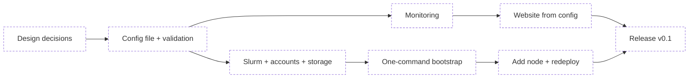

> Items are functional bullets: what we want (behaviour/function/outcome), not how to build it. The "how" stays in-session, not here. Notation: `[ ]` planned → `[~]` WIP → `[x]` done and verified. Keep it live: flip markers as work progresses, not just at commit time. When done, move a one-liner `[x]` here and a concise record of what was built to `md/DONE.md`.
> The `Implementation` section opens with the implementation-roadmap `mermaid` diagram (see [`DIAGRAMS.md`](md/instructions/DIAGRAMS.md)), status-matched to the bullets below it.
> (See AGENTS.md for the full workflow.)

# TODO

## Implementation

### Design

- [ ] The open design decisions listed in [PROJECT.md](PROJECT.md) (Notes) are agreed with the user and recorded.
- [ ] A written example configuration file describes a small cluster (one front node, two GPU compute nodes) and is agreed as the target format.

### Configuration

- [ ] The administrator describes the whole cluster in one configuration file: front node, compute nodes, users, queue policy.
- [ ] An invalid configuration is rejected before any machine is changed, with a message that names the wrong field.
- [ ] The cluster name from the configuration is used everywhere: paths, dashboards, website. No site name is hardcoded.

### Cluster setup

- [ ] Slurm is installed on all machines without the administrator filling in package names by hand.
- [ ] Users listed in the configuration exist on every machine with the same UID.
- [ ] Users can log in to the front node. Only administrators can log in to compute nodes directly.
- [ ] `/home` is shared from the front node to all compute nodes, with the per-user quotas from the configuration.
- [ ] Each compute node has local scratch, and old scratch files are cleaned up automatically.
- [ ] `main` and `interactive` partitions work with the GPU fair-share priority and per-user limits from the configuration.
- [ ] `cluster-submit` runs a job on a private scratch copy of the project and copies declared outputs back.
- [ ] uv is available to users on all machines.
- [ ] Health checks report broken Slurm services, full disks, and stale GPU readings.

### Monitoring and website

- [ ] Prometheus collects machine and GPU metrics from every compute node over mutually authenticated TLS.
- [ ] Grafana dashboards (queue, queue history, GPU usage, machines, long-term history) work for any number of nodes.
- [ ] The status collector writes the website snapshot every 30 seconds.
- [ ] The website shows machine status, queue, GPU usage, and current policies for any cluster, read-only.
- [ ] Cluster name, logo, login address, and the user guide on the website come from the configuration.
- [ ] The Machines page shows a minimal retro-style animated diagram of the cluster architecture, which users can turn on and off with a button.

### Commands

- [ ] One command sets up a new cluster on fresh machines from the configuration file.
- [ ] One command adds a new compute node listed in the configuration.
- [ ] Rerunning the setup after a configuration change applies only that change and does not break a running cluster.

### Release

- [ ] A full setup is tested on fresh virtual machines, from an empty state to a job running on a compute node and visible on the website.
- [ ] Administrator documentation covers requirements, configuration, setup, adding nodes, and common problems.
- [ ] The repository is published under the chosen license.
- [ ] A nice retro-style and/or ASCII animation of the project exists, to use as promo on LinkedIn when sharing the project in the open.

### Later

- [ ] Optional `backup` module that copies home directories to a storage service chosen by the administrator.

## Uncategorized

- [ ] ...
