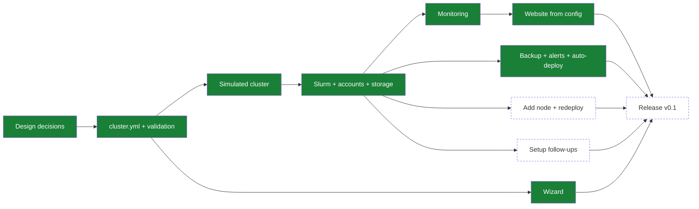

> Items are functional bullets: what we want (behaviour/function/outcome), not how to build it. The "how" stays in-session, not here. Notation: `[ ]` planned → `[~]` WIP → `[x]` done and verified. Keep it live: flip markers as work progresses, not just at commit time. When done, move a one-liner `[x]` here and a concise record of what was built to `md/DONE.md`.
> The `Implementation` section opens with the implementation-roadmap `mermaid` diagram (see [`DIAGRAMS.md`](md/instructions/DIAGRAMS.md)), status-matched to the bullets below it.
> (See AGENTS.md for the full workflow.)

# TODO

## Implementation

Agreed decisions for the port: [plan-port.md](md/plan-port.md).

### Design

- [x] The open design decisions are agreed with the user and recorded ([plan-port.md](md/plan-port.md)).
- [x] Where the cluster roles run is agreed: the front node always does login, the Slurm controller, monitoring, and the website; `/home` and the backup can each be on the front node or on separate machines.
- [x] How to test nanoHPC without real machines is decided ([testing.md](md/testing.md)).

### Configuration

- [x] Written example `cluster.yml` files (the 6-node test cluster, and a minimal front node + one GPU node) are agreed with the user as the target format.
- [x] The administrator describes the whole cluster in one `cluster.yml`: front node, compute nodes (GPU or CPU-only, mixed NVIDIA models), optional storage and backup machines, users, partitions, and queue policy.
- [x] Partitions and their limits are defined by the administrator, not fixed to `main` and `interactive`.
- [x] Each partition can accept only batch jobs, only the interactive shell, or any job (`jobs: batch | interactive | any`), with clear messages when a job is refused.
- [x] An invalid configuration is rejected before any machine is changed, with a message that names the wrong field.

### Simulated cluster

- [x] One command creates the everyday test cluster as Lima VMs from a `cluster.yml`: a front node, 4 compute nodes (4 GPUs, 2 GPUs, CPU-only, 4 GPUs `interactive` only), and a storage machine, and removes it again.
- [x] The same command works on macOS (Apple Silicon).
- [x] The same command works on Linux (x86), checked on GitHub Actions.
- [x] The test cluster can be run with `/home` on the front node (backup to the storage machine) and with `/home` on the storage machine (no backup).
- [x] Fake GPUs are set in a separate test-only file, not in `cluster.yml`.
- [x] The test cluster can be scaled up to 20 compute nodes.
- [x] The tests only need a list of SSH machines and a `cluster.yml`, so they also run against other machines (cloud VMs, spare machines).

### Cluster setup

- [x] Slurm is built from the official source (newest stable version, then pinned: 26.05.4) for each CPU type and installed on all machines. Checked on ARM64 (simulated cluster).
- [ ] The Slurm build is checked on x86 (a deploy on the GitHub Actions Linux runner, run by hand once before the release).
- [x] Ubuntu 22.04, 24.04, and 26.04 are supported, checked with a deploy on the simulated cluster for each (ARM64), including sudo by forwarded key with 26.04's `sudo-rs`.
- [x] Users listed in the configuration are created on every machine with the same UID and their SSH keys. Login is by SSH key only; password login is off.
- [x] If a machine already has a listed user with a different UID or group ID, the deploy stops on that machine without changing it, and says what conflicts and what to do next.
- [x] If a machine has a local `/home` with data, the deploy stops on that machine without changing it, and says what to do next.
- [ ] `nanohpc fix-uid USER MACHINE` harmonises a user's UID on one machine safely, only when the administrator runs it: it refuses while the user has running processes, and lists the files it will re-own before changing anything.
- [x] Users can log in to the front node. Only administrators can log in to the other machines directly.
- [x] nanoHPC never adds passwordless sudo rules. Administrators listed in `cluster.yml` use `sudo` through their forwarded SSH key (`ssh -A`, `pam_ssh_agent_auth`), by hand and for later deploys, so no password is typed or stored.
- [x] Administrators' sudo by forwarded key also works on Ubuntu 26.04+ machines that mount `/home` (OpenSSH 10.1+ keeps the agent socket in the home folder): `/home` is exported with `no_root_squash` and mounted `nosuid,nodev` on every machine, so no program in `/home` can gain root.
- [x] `nanohpc deploy` checks sudo on every machine before changing anything. The first setup of a machine needs root the normal way: if sudo needs a password and someone is at a terminal, it asks once and keeps it in memory for that run only; if no one can type it (for example an agent), it stops and explains the options (such as running that one command by hand with `! nanohpc deploy` in Claude Code).
- [x] The Munge key is created and copied to all machines automatically.
- [x] The metrics certificates are created, copied to all machines, and renewed before they expire, by each deploy (a cluster must be deployed at least once a year until automatic redeploy exists; `cluster-health` on the front node warns 30 days before any certificate expires).
- [x] GPU nodes are checked for the GPU count in the configuration, with a clear message if the NVIDIA driver is missing or the count differs.
- [x] nanoHPC never formats a disk. The home and scratch disks named in the configuration must already have a filesystem; nanoHPC checks its type and mounts it, and stops with the command to run if the disk has no filesystem.
- [x] `/home` is shared from the front node, or from a separate storage machine, to all machines, with the per-user quotas from the configuration.
- [x] Each compute node has local scratch (a disk, or an image file nanoHPC creates), and staged scratch data unused for `scratch.cleanup_days` is cleaned up daily. Per-user caches in `/scratch/<user>` are not cleaned.
- [x] Partitions work with the GPU fair-share priority and per-user limits from the configuration.
- [x] `cluster-submit` runs a job on a private scratch copy of the project and copies declared outputs back.
- [x] uv is available to users on the front node and the compute machines.
- [x] `stage-dataset --private` stages a user's data on a compute machine's scratch for reuse across jobs.
- [x] Health checks report broken Slurm services and full disks (`cluster-health`, run at the end of every deploy).
- [x] On the simulated cluster, Slurm schedules GPU jobs on the fake GPU nodes.
- [x] On the simulated cluster, a fake exporter reports GPU metrics.

### Cluster setup follow-ups

- [x] Health checks report stale GPU readings, stale machine specs, missing metrics, and failing daily rules (`cluster-health` on the front node).
- [ ] `stage-dataset --shared` stages datasets from a shared datasets area (needs that area first).
- [ ] Scratch copies that `cluster-submit` keeps after a failed job (`/scratch/<user>/cluster-jobs/job-*`, kept so the user can look at them) are cleaned up after some days; today only the user can remove them, and the daily cleanup only handles staged data. The source deployment added this on 2026-10-02 (`scratch-job-cleanup`: copies removed 7 days after their job ended), to port.
- [ ] After a deploy, a rebooted machine comes back with `/home`, quotas, the NFS mounts, and `/scratch` (checked on the simulated cluster; no test reboots a machine yet).
- [ ] XFS home and scratch disks, and quota enforcement over NFS (a user over the hard limit cannot write), are checked on the simulated cluster.
- [ ] Quotas survive kernel upgrades: on Ubuntu cloud kernels the quota modules come from `linux-modules-extra-<kernel>`, which nanoHPC installs for the running kernel only. After a kernel upgrade the `/home` mount with quotas could fail at boot until the next deploy.
- [ ] Admins have direct access to computing nodes even if the front node is down: every machine, front and compute, is reachable directly over SSH, and an administrator can log in and use sudo on any machine while the home server is down. Today the login is accepted (keys and accounts are local) but can hang on the `hard` NFS `/home` mount, and on Ubuntu 26.04 sudo by forwarded key needs the agent socket in the NFS home; a recovery login that does not touch NFS is also missing: key-only root login for the administrators in `cluster.yml` on every machine, with the keys on local disk (agreed 2026-10-02). Checked on the simulated cluster by stopping the home server. The source deployment has recent work on this (`roles/ssh_access`, `playbooks/admin-access.yml`, uncommitted on 2026-10-02) to look at.

### Monitoring and website

- [ ] The cluster name from the configuration is shown in the website, dashboards, and Slurm. Install paths are fixed (`/etc/nanohpc`, `/var/lib/nanohpc`). No site name is hardcoded.
- [x] Prometheus collects machine and GPU metrics from every machine over mutually authenticated TLS.
- [x] Daily summaries are kept for 5 years (the history Prometheus).
- [x] The daily summaries are shown in the long-term history in Grafana.
- [x] The daily summaries are shown in the long-term history on the website.
- [x] Grafana dashboards (queue, queue history, GPU usage, machines, long-term history) work for any number of nodes, GPU and CPU-only.
- [x] The status collector writes the website snapshot every 30 seconds.
- [x] The website shows machine status, queue, GPU usage, and current policies for any cluster, read-only.
- [x] Cluster name, logo, login address, and the user guide on the website come from the configuration.
- [x] The website is served by its own nginx over HTTPS, with a Let's Encrypt certificate or the administrator's own certificate.
- [x] The website is served under a configurable path (default `/cluster/`), with Grafana under it.
- [x] nanoHPC prints ready-made forwarding rules (nginx, Apache, Caddy) so a lab's own website can show the cluster site at `labwebsite.com/cluster/`.
- [x] Anyone can read the website by default (no login); `cluster.yml` can limit it to listed networks.
- [x] The website ships prebuilt in the nanoHPC package; `cluster.yml` can choose to build it on the front node instead.
- [x] Let's Encrypt certificates are requested and renewed on the simulated cluster, against Pebble (Let's Encrypt's test server).
- [ ] The Machines page shows a minimal retro-style animated diagram of the cluster architecture, which users can turn on and off with a button.

- [ ] Above the soft limit (`home.quota_soft_gb` in `cluster.yml`, e.g. 300 GB) users only get a notice; writing never stops (today the soft limit becomes a hard stop after `quota_grace`).
- [ ] No hard limit for writing to `/home`; the hard limit (`home.quota_hard_gb`) applies to running jobs instead: a user above it cannot start jobs until they clean up, which is more flexible (today the filesystem stops writes at the hard limit).
- [ ] Machines boot normally when the machine serving `/home` is down: `/home` is mounted with `hard,nofail,x-systemd.automount,x-systemd.mount-timeout=90` (plus `nosuid,nodev`), so the boot never waits on it, SSH comes up, and `/home` connects by itself on first use once the server answers (as in the source deployment, commit 7b76d31, roles/nfs_client). Checked on the simulated cluster by rebooting a compute node with the home server down. Agreed for later (2026-10-02); no live remount handling needed before v0.1, since no real cluster runs nanoHPC yet.
- [ ] Website follow-ups: the printed forwarding rules are tried with real nginx, Apache, and Caddy (with `forwarded_by`); switching between certificate types, hostnames, paths, and build modes is checked on the simulated cluster; nginx starts on machines with IPv6 turned off.

### Backup, alerts, and auto-deploy

- [x] `/home` is copied every night with rsync to the backup machine in the cluster or to an outside SSH server, as one mirror of `/home` (files deleted from `/home` are deleted from the copy). A failed backup is reported.
- [x] Every machine runs its health checks every few minutes; the front node sends Slack alerts (off by default) when a check starts failing or warning and when it recovers, not on every run, plus failed backups and failed automatic deploys. The Slack webhook is in a `.env` file next to `cluster.yml` (never committed), copied to the front node by the deploy.
- [x] The front node can redeploy the whole cluster automatically from the administrator's configuration repository (off by default): it checks a branch every 10 minutes (set in `cluster.yml`; `main` by default, a stable or release branch suggested), pulls it with a read-only key, and deploys every machine itself with no one logging in and no password. A GitHub webhook can trigger it right after a push instead of waiting. The front node gets root SSH access to every machine for this (agreed 2026-10-02). The configuration repository pins the nanoHPC version the front node uses. `nanohpc deploy` from the administrator's machine stays. Until the dry run exists (M8), automatic deploys apply without it; then each one runs the dry run first, applies only if it passed, and otherwise stops and alerts.

### Commands

- [ ] `nanohpc` is installed with `uv tool install` and runs from any machine with SSH access to the cluster.
- [ ] Every deploy runs a read-only dry run first (Ansible check mode on every machine; nothing changes) and continues to the real run on its own only if the dry run passed. A failed dry run stops with the cluster unchanged and says what failed. Every role works in check mode (a first deploy of a new machine can only be partly previewed).
- [x] `nanohpc init` is a full-screen terminal wizard (Textual) that writes a whole `cluster.yml` with simple defaults, or opens an existing one to change it, and probes the machines over SSH for CPUs, memory, GPU type and count, disks, and Ubuntu version. Its steps: machines, storage, users, partitions and policy, website, extras, review.
- [x] `SETUP-for-AGENTS.md` lists the setup steps for agents, matching the wizard's (agents write `cluster.yml` from the examples); AGENTS.md links to it, and the wizard's footer points to it for an installation by an AI agent.
- [x] The wizard guides the administrator through preparing the machines (for example making the filesystems on the home and scratch disks), with hints for each step and the option to skip and do it themselves. It mentions `ssh-add -c` (confirm each use of the key, for example to watch an agent) as an option, not the default, and says that a deploy uses the key for every sudo call, so `-c` asks many times during a deploy.
- [x] The wizard and the docs explain the three kinds of storage (home: small, safe, backed up; shared scratch: large, fast, cleaned by age; local scratch: per machine, per job), recommend a faster network (10 GbE or more) before adding shared storage, and suggest moving `/home` off the front node to its own storage machine (or a NAS) as the cluster grows.
- [x] The wizard asks for the website's hostname, path, HTTPS choice, and who can open it, and recommends (says it is not required) a private network such as WireGuard or Tailscale for security and simpler administrator access.
- [x] While probing the machines, the wizard finds users whose UID differs between machines (or from `cluster.yml`) and guides the administrator to harmonise them before the first deploy, using `nanohpc fix-uid` (built in M7: after the administrator confirms and a read-only check, it renumbers that user on that machine). The deploy's stop on a UID conflict stays as a safety net.
- [ ] `nanohpc deploy` sets up a new cluster on fresh machines from `cluster.yml`, and runs every part below.
- [ ] Rerunning `nanohpc deploy` after a configuration change applies only that change and does not break a running cluster.
- [ ] Partial deploys instead of separate commands (agreed 2026-10-03): after editing `cluster.yml` (by hand or with the wizard), `nanohpc deploy --only users|policy|partitions` or `--only node NAME` runs just that part, with the same checks and dry run.
- [ ] `nanohpc check` connects to every machine and reports what differs from `cluster.yml` (services, users, mounts, GPU count), without changing anything.

### Release

- [ ] A README, curated by the user (not filled in by the agent): a title for nanoHPC using the same neobrutalism components as the front-end monitor; a description of nanoHPC as a minimalistic Slurm + Slurm monitoring tool for small lab clusters; a features section (a concise list); how to use it; the tech stack; how to contribute, linking to CONTRIBUTING.md; and the license (MIT).
- [ ] Before the release, the real-VM tests pass on Ubuntu 22.04 and 26.04 too (during development they run on 24.04 only).
- [ ] Once nanoHPC is released and development slows down, bring the split-out real-VM tests (`SimRedeployTest`, `SimAlertsTest`, and the ones run only when relevant) back into every run, so users get proper tests when deploying on their systems.
- [ ] A full setup is tested on the simulated cluster, from an empty state to a job running on a compute node and visible on the website.
- [ ] A full setup is tested on real x86 machines, and once on a real GPU machine for the NVIDIA driver and CUDA.
- [ ] Administrator documentation covers requirements, configuration, setup, adding nodes, and common problems, including root access for deploys (first setup, forwarded keys) and `ssh-add -c` as an option.
- [ ] The repository is published under the MIT license.
- [ ] A nice retro-style and/or ASCII animation of the project exists, to use as promo on LinkedIn when sharing the project in the open.

### Later

- [ ] Explore whether nanoHPC can be sold as a commercial product while it stays fully open source. Very exploratory. Ideas to look at: providing some of the infrastructure on the server side, or an app to see the cluster status (the current view is that the website is the best way to do this).
- [ ] restic backups with dated snapshots, and S3-style storage as a backup destination.
- [ ] Users from an existing directory (LDAP) instead of local users.
- [ ] AMD GPUs.
- [ ] Test nanoHPC on non-Ubuntu machines.
- [ ] Move the REAL cluster from SLURM-REAL to nanoHPC (maybe, not planned).
- [ ] A link to a live demo in the GitHub repository, so people can see what it looks like on a simulated cluster.
- [ ] Optional shared scratch on a separate storage machine (not the front node), seen by every compute node: a fast NFS server with NVMe or SSD disks first, BeeGFS later. Files unused for N days (30 to 90) are deleted by a daily cleanup. Needs a fast network; `stage-dataset --shared` builds on it.
- [ ] A general "Welcome to <cluster name>" login banner (with a small "powered by nanoHPC") and some general info. Below it, notifications for that user only: when they are above the soft limit of their home usage (as defined in `cluster.yml`, the same for all users), they are told to clean up, with a summary of where most of their space is (for example a certain repository or certain worktrees).
- [ ] See how the terminal login banner looks in SLURM-REAL and use it as inspiration for the login banner above. There it is `roles/job_modes/files/real-hpc` (big block-letter title with a short animation and time-of-day colours, then the user's jobs, the cluster's jobs, the 7-day waiting time, GPU-hours and ranking, an impact estimate, and home space with the largest folders), `roles/home_space` (each user's usage, readable only by them), and `roles/login_notice` (shown on interactive logins); tests in `tests/test_real_hpc.py`. In nanoHPC the title is the cluster name from `cluster.yml` and the links point to the cluster's own website; the impact estimate is kept as in SLURM-REAL (same fixed assumptions), to make configurable later (agreed 2026-10-03; the banner stays in Later).
- [ ] SLURM-REAL's website added a Waiting time card (24h, 7d, 30d) and a "Powered by nanoHPC" footer (2026-10-03, commit b05616c); consider them for nanoHPC's website.
- [ ] A way to use only the cluster monitoring part (metrics, alerts, status snapshot, Grafana, website) without the Slurm part, for people who already have Slurm installed and want to add nanoHPC's monitoring to it.
- [ ] A webapp to manage the admin/configuration part of the cluster from the webapp itself, separate from the normal cluster monitoring app to avoid security risks.

## Uncategorized

- [x] Compare the deployment mode with SLURM-REAL and pick one (2026-10-02: full-cluster pull for automatic deploys, next to `nanohpc deploy`; see the auto-deploy item).
- [x] Check how SLURM-REAL does the auto deployment without the user having to SSH in manually and without entering the password every time the agent does something, then have a conversation with the user about whether nanoHPC does the same (relates to the auto-deploy item under "Backup, alerts, and auto-deploy" and the deployment mode comparison above).
