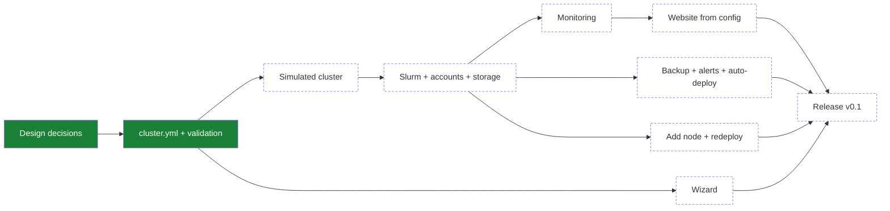

> Items are functional bullets: what we want (behaviour/function/outcome), not how to build it. The "how" stays in-session, not here. Notation: `[ ]` planned → `[~]` WIP → `[x]` done and verified. Keep it live: flip markers as work progresses, not just at commit time. When done, move a one-liner `[x]` here and a concise record of what was built to `md/DONE.md`.
> The `Implementation` section opens with the implementation-roadmap `mermaid` diagram (see [`DIAGRAMS.md`](md/instructions/DIAGRAMS.md)), status-matched to the bullets below it.
> (See AGENTS.md for the full workflow.)

# TODO

## Implementation

Agreed decisions for the port: [plan-port.md](md/plan-port.md).

### Design

- [x] The open design decisions are agreed with the user and recorded ([plan-port.md](md/plan-port.md)).
- [x] Where the cluster roles run is agreed: the front node always does login, the Slurm controller, monitoring, and the website; `/home` and the backup can each be on the front node or on separate machines.
- [x] How to test nanoHPC without real machines is decided ([testing.md](md/testing.md)).

### Configuration

- [x] Written example `cluster.yml` files (the 6-node test cluster, and a minimal front node + one GPU node) are agreed with the user as the target format.
- [x] The administrator describes the whole cluster in one `cluster.yml`: front node, compute nodes (GPU or CPU-only, mixed NVIDIA models), optional storage and backup machines, users, partitions, and queue policy.
- [x] Partitions and their limits are defined by the administrator, not fixed to `main` and `interactive`.
- [x] An invalid configuration is rejected before any machine is changed, with a message that names the wrong field.

### Simulated cluster

- [ ] One command creates the everyday test cluster as Lima VMs from a `cluster.yml`: a front node, 4 compute nodes (4 GPUs, 2 GPUs, CPU-only, 4 GPUs `interactive` only), and a storage machine, and removes it again.
- [ ] The same command works on macOS (Apple Silicon) and Linux (x86).
- [ ] The test cluster can be run with `/home` on the front node (backup to the storage machine) and with `/home` on the storage machine (no backup).
- [ ] Fake GPUs are set in a separate test-only file, not in `cluster.yml`.
- [ ] The test cluster can be scaled up to 20 compute nodes.
- [ ] Fake GPUs: Slurm schedules GPU jobs on the fake GPU nodes, and a fake exporter reports GPU metrics.
- [ ] The tests only need a list of SSH machines and a `cluster.yml`, so they also run against other machines (cloud VMs, spare machines).

### Cluster setup

- [ ] Slurm is built from the official source (newest stable version, then pinned) for each CPU type and installed on all machines.
- [ ] Ubuntu 22.04, 24.04, and 26.04 are supported.
- [ ] Users listed in the configuration are created on every machine with the same UID and their SSH keys.
- [ ] Users can log in to the front node. Only administrators can log in to the other machines directly.
- [ ] The Munge key and metrics certificates are created and copied to all machines automatically.
- [ ] GPU nodes are checked for the GPU count in the configuration, with a clear message if the NVIDIA driver is missing or the count differs.
- [ ] `/home` is shared from the front node, or from a separate storage machine, to all machines, with the per-user quotas from the configuration.
- [ ] Each compute node has local scratch, and old scratch files are cleaned up automatically.
- [ ] Partitions work with the GPU fair-share priority and per-user limits from the configuration.
- [ ] `cluster-submit` runs a job on a private scratch copy of the project and copies declared outputs back.
- [ ] uv is available to users on all machines.
- [ ] Health checks report broken Slurm services, full disks, and stale GPU readings.

### Monitoring and website

- [ ] The cluster name from the configuration is shown in the website, dashboards, and Slurm. Install paths are fixed (`/etc/nanohpc`, `/var/lib/nanohpc`). No site name is hardcoded.
- [ ] Prometheus collects machine and GPU metrics from every machine over mutually authenticated TLS.
- [ ] Daily summaries are kept for 5 years and shown in the long-term history.
- [ ] Grafana dashboards (queue, queue history, GPU usage, machines, long-term history) work for any number of nodes, GPU and CPU-only.
- [ ] The status collector writes the website snapshot every 30 seconds.
- [ ] The website shows machine status, queue, GPU usage, and current policies for any cluster, read-only.
- [ ] Cluster name, logo, login address, and the user guide on the website come from the configuration.
- [ ] The website is served by its own nginx over HTTPS, with a Let's Encrypt certificate or the administrator's own certificate.
- [ ] The Machines page shows a minimal retro-style animated diagram of the cluster architecture, which users can turn on and off with a button.

### Backup, alerts, and auto-deploy

- [ ] `/home` is copied every night with rsync to the backup machine in the cluster or to an outside SSH server.
- [ ] Health checks can send alerts to Slack (off by default).
- [ ] The front node can redeploy automatically when the administrator's configuration repository changes on GitHub (off by default).

### Commands

- [ ] `nanohpc` is installed with `uv tool install` and runs from any machine with SSH access to the cluster.
- [ ] `nanohpc init` is a wizard that writes a whole `cluster.yml` with simple defaults, and probes the machines over SSH for CPUs, memory, and GPU type and count.
- [ ] One command sets up a new cluster on fresh machines from `cluster.yml`.
- [ ] One command adds a new compute node listed in the configuration.
- [ ] Rerunning the setup after a configuration change applies only that change and does not break a running cluster.

### Release

- [ ] A full setup is tested on the simulated cluster, from an empty state to a job running on a compute node and visible on the website.
- [ ] A full setup is tested on real x86 machines, and once on a real GPU machine for the NVIDIA driver and CUDA.
- [ ] Administrator documentation covers requirements, configuration, setup, adding nodes, and common problems.
- [ ] The repository is published under the MIT license.
- [ ] A nice retro-style and/or ASCII animation of the project exists, to use as promo on LinkedIn when sharing the project in the open.

### Later

- [ ] Explore whether nanoHPC can be sold as a commercial product while it stays fully open source. Very exploratory. Ideas to look at: providing some of the infrastructure on the server side, or an app to see the cluster status (the current view is that the website is the best way to do this).
- [ ] restic backups with dated snapshots, and S3-style storage as a backup destination.
- [ ] Users from an existing directory (LDAP) instead of local users.
- [ ] AMD GPUs.
- [ ] Test nanoHPC on non-Ubuntu machines.
- [ ] Move the REAL cluster from SLURM-REAL to nanoHPC (maybe, not planned).
- [ ] A link to a live demo in the GitHub repository, so people can see what it looks like on a simulated cluster.

## Uncategorized

- [ ] ...
